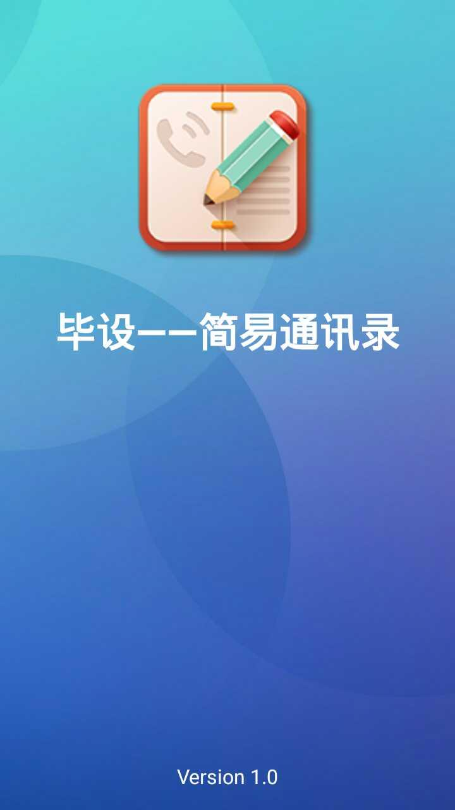
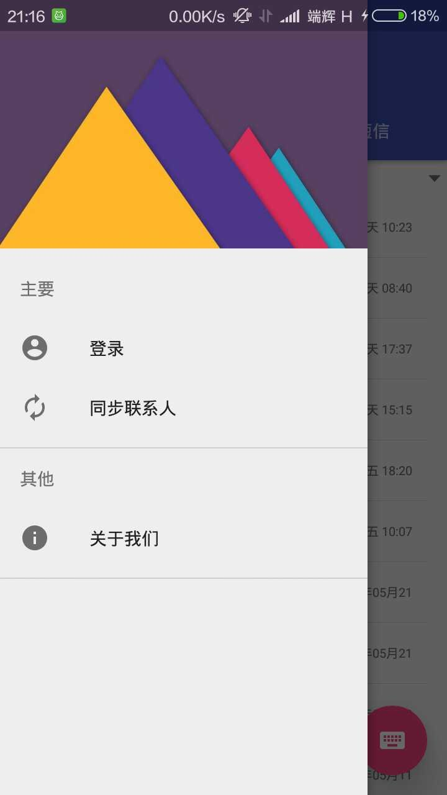

# 简易通讯录
> 这个本人的毕业设计，比较简陋 
  但也是学Android的成果，记录下来，记录成长。

## 实现的基本功能
  * 通话记录的展示
  * 联系人信息的展示
  * 短息信息的展示
  * 简单的用户注册登录（简单的将用户信息存到服务端）
  * 联系人信息的同步（将联系人信息存储成Vcard格式文件存放到服务端）

---

## 现实过程
  1. 了解Android联系人数据库，及其相关SDK的调用
  2. 自定义首字母侧滑栏及其快速定位功能
  3. 自定义数字按键及其出现动画与隐藏动画
  3. pinyin4j与android-Vcard的使用
  4. 与服务端的通信(HttpUrlConnection，Gson)
---

## TODO 最后添加几张截图

